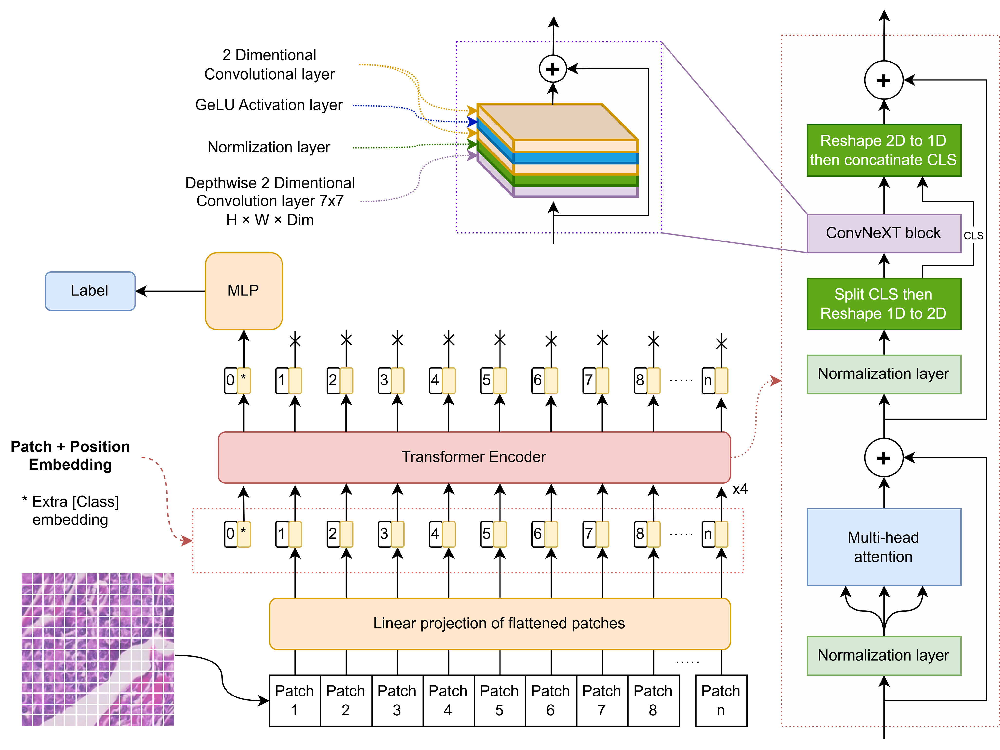

# Lightweight ConvNeXt-ViT for Explainable Breast Cancer Histopathology Classification

PyTorch implementation of a lightweight ConvNeXt-ViT hybrid model for breast cancer histopathology classification using the BreakHis dataset.

## Overview

This repository contains the code and configuration files for the unpublished ConvNeXt-ViT work on breast cancer histopathology image classification. The project focuses on:

- Binary classification of BreakHis images as benign or malignant.
- Multiclass classification of BreakHis tumor subtypes.
- A lightweight ConvNeXt-ViT hybrid architecture.
- Explainability through CAM-based visualizations and attention-map analysis.
- Fold-based training and evaluation using BreakHis CSV manifests.

Full experimental details and complete results will be provided in the associated manuscript after publication.

## Proposed Model

The proposed ConvNeXt-ViT model combines transformer-style global context modeling with ConvNeXt-style local texture modeling. In the hybrid block, image tokens are processed with multi-head self-attention, reshaped into a 2D representation, refined with a ConvNeXt unit, and then returned to the token sequence for classification.

This design preserves the global reasoning of Vision Transformers while adding convolutional locality that is important for histopathology texture, tissue morphology, and CAM-compatible interpretability.



Figure: Architecture of the proposed ConvNeXt-ViT model.

## Dataset

The repository is scoped to the BreakHis breast cancer histopathology dataset. The manuscript evaluates the proposed model using the BreakHis binary and multiclass classification settings under a magnification-independent protocol.

The multiclass task includes benign and malignant tumor subtypes represented in BreakHis. The binary task groups samples into benign and malignant categories.

## Repository Structure

```text
.
|-- configs/                 # BreakHis YAML experiment configurations
|   |-- convnext-vit/        # ConvNeXt-ViT fold configs
|   |-- convnext/            # ConvNeXt baseline fold configs
|   |-- vit-s/               # ViT-S baseline fold configs
|   `-- binary/              # Binary-classification configs
|-- data/
|   `-- folds/               # BreakHis fold CSV manifests
|-- figures/                 # Proposed model figure
|-- notebooks/               # Optional research notebooks
|-- outputs/                 # Generated local outputs
|-- scripts/                 # BreakHis runners and post-processing scripts
|-- src/                     # Training, evaluation, dataset, model, and explainability code
|-- requirements.txt         # Python dependencies
|-- test_env.py              # Environment validation helper
`-- README.md
```

## Installation

Create and activate a Python virtual environment from the repository root, then install the dependencies:

```powershell
python -m venv .venv
.\.venv\Scripts\Activate.ps1
python -m pip install --upgrade pip
pip install -r requirements.txt
```

The checked-in dependency file includes CUDA-enabled PyTorch package versions. Adjust the PyTorch installation command if your local CUDA, CPU-only, or platform requirements differ.

Optional environment check:

```powershell
python test_env.py
```

## Usage

Run commands from the repository root with the virtual environment activated.

### Train One BreakHis Fold

```powershell
python -m src.train_cli --config configs/convnext-vit/breakhis_fold1.yaml --device cuda --seed 42 --smoke-train
```

### Evaluate One BreakHis Fold

```powershell
python -m src.evaluate_cli --config configs/convnext-vit/breakhis_fold1.yaml --device cuda --seed 42 --checkpoint outputs/checkpoints/convnext-vit/breakhis_fold1_last.pt
```

### Resume Training

```powershell
python -m src.train_cli --config configs/convnext-vit/breakhis_fold1.yaml --device cuda --seed 42 --smoke-train --resume outputs/checkpoints/convnext-vit/breakhis_fold1_last.pt
```

### Run BreakHis Folds

Use the BreakHis fold runner:

```powershell
scripts\run_all_folds.ps1 -Device cuda -Model convnext-vit -Seed 42 -StartFold 1 -EndFold 5
```

Supported `-Model` values:

- `convnext-vit`
- `vit-s`
- `convnext`

Useful flags:

- `-Binary` uses binary-classification configs under `configs/binary/`.
- `-SkipTrain` runs evaluation only.
- `-SkipEval` runs training only.
- `-Resume` resumes from the latest fold checkpoint when present.
- `-Deterministic` enables deterministic mode.
- `-ContinueOnError` continues after a failed fold.

## Results / Outputs

Training and evaluation artifacts are written under `outputs/` according to each YAML configuration. Typical generated files include checkpoints, training histories, prediction metrics, confusion matrices, ROC curves, and explainability figures.

Generated experiment outputs are local artifacts and should not be treated as final published results.

## Key Results

Compact manuscript-reported final results for the proposed ConvNeXt-ViT model on BreakHis:

| Task | Accuracy |
| --- | --- |
| Binary classification | 99.5489 +/- 0.4831% |
| Multiclass classification | 97.1518 +/- 2.0973% |

Full experimental details and complete results will be provided in the associated manuscript after publication.


## Funding

This work was supported by the Ministry of Higher Education, Malaysia, and The National University of Malaysia through the Fundamental Research Grant Scheme (FRGS), Grant No. `FRGS/1/2023/TK07/UKM/02/6`.

## License

This repository is provided as open access.


